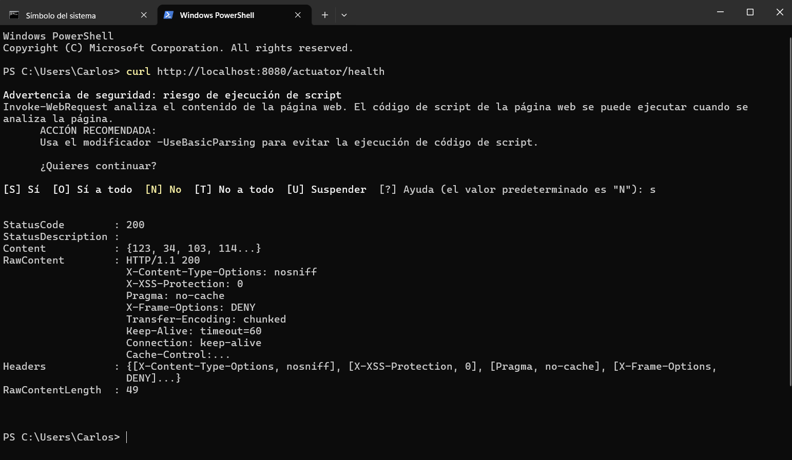
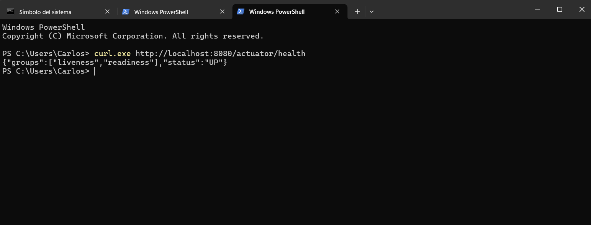
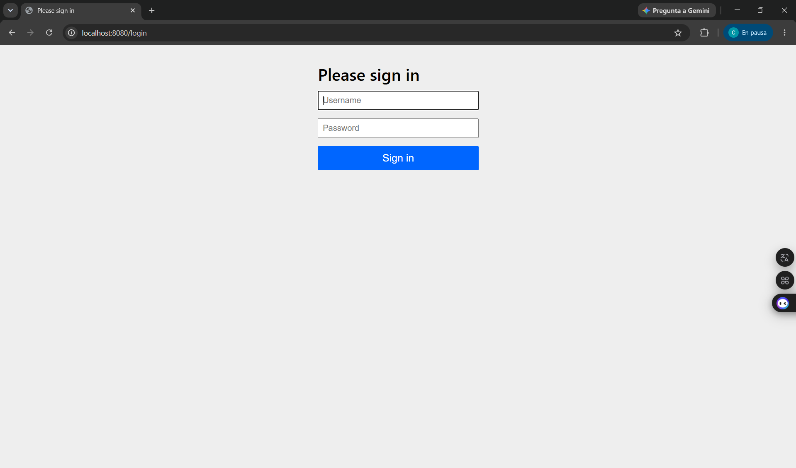
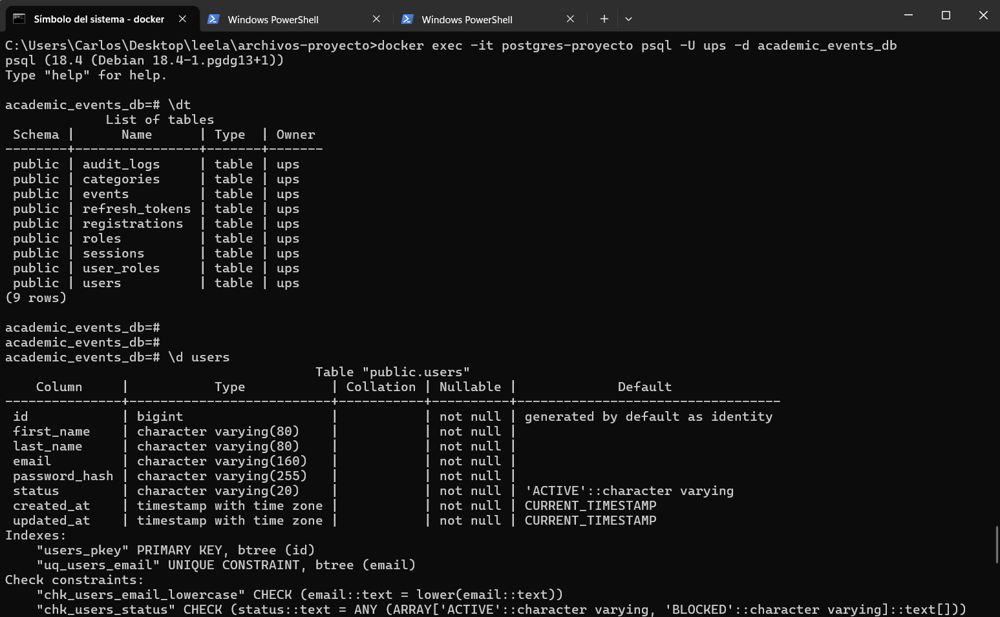

# Programación y Plataformas Web


# Academic Events API
## Sistema de Gestión de Eventos Académicos con Spring Boot, JWT y PostgreSQL

<div align="center">
  
  
  
  
</div>

---

## Proyecto Final

## Autores

**Carlos Antonio Gordillo Tenemaza**
* 📧 Correo: [antoniogordillo.1808@gmail.com](mailto:antoniogordillo.1808@gmail.com)
* 💻 GitHub: [antonikr8s](https://github.com/antonikr8s)
* 💼 LinkedIn: [Carlos Gordillo](https://linkedin.com/in/carlos-antonio-gordillo-tenemaza-828540281/)

**David Esteban Sisa Buestan**
* 📧 Correo: [sisabuestandavidesteban@gmail.com](mailto:sisabuestandavidesteban@gmail.com)
* 💻 GitHub: [Riiiiii1](https://github.com/Riiiiii1)
* 💼 LinkedIn: [David Sisa](https://www.linkedin.com/in/david-esteban-sisa-buestan/)


---

## Capturas de Pantalla


### 1. Servidor funcionando
**Descripción:** Se verifica que la API Spring Boot esté levantada correctamente y pueda recibir solicitudes HTTP.



### 2. Backend levantado
**Descripción:** Se comprueba el estado de salud del backend mediante el endpoint de Actuator. Una respuesta con estado `UP` confirma que la aplicación inició correctamente.



### 3. Comprobar Swagger
**Descripción:** Se verifica el acceso a la documentación de la API mediante Swagger UI. Actualmente la ruta está protegida por Spring Security mientras se termina la configuración de autenticación JWT.



### 4. Verificación de base de datos PostgreSQL
Se accede al contenedor PostgreSQL mediante Docker para comprobar la existencia de la base de datos y consultar las tablas creadas por los scripts iniciales.



Comando utilizado:

```bash
docker exec -it postgres-proyecto psql -U ups -d academic_events_db
```
Comandos utilizados dentro de PostgreSQL:
```
-- Mostrar las tablas existentes
\dt

-- Revisar estructura de usuarios
\d users

-- Revisar estructura de roles
\d roles

-- Revisar tabla intermedia usuario-rol
\d user_roles
```


