# Programación y Plataformas Web


# Academic Events API
## Sistema de Gestión de Eventos Académicos con Spring Boot, JWT y PostgreSQL

<div align="center">
  
  
  
  
</div>

---

## Proyecto Final

## Autores

**Carlos Antonio Gordillo Tenemaza**
* 📧 Correo: [antoniogordillo.1808@gmail.com](mailto:antoniogordillo.1808@gmail.com)
* 💻 GitHub: [antonikr8s](https://github.com/antonikr8s)
* 💼 LinkedIn: [Carlos Gordillo](https://linkedin.com/in/carlos-antonio-gordillo-tenemaza-828540281/)

**David Esteban Sisa Buestan**
* 📧 Correo: [sisabuestandavidesteban@gmail.com](mailto:sisabuestandavidesteban@gmail.com)
* 💻 GitHub: [Riiiiii1](https://github.com/Riiiiii1)
* 💼 LinkedIn: [David Sisa](https://www.linkedin.com/in/david-esteban-sisa-buestan/)

---

## Instalación y Requisitos

> Completar esta sección con el paso a paso definitivo antes de entregar. Dejo la estructura lista.

**Requisitos previos:**
- JDK 21 (o la versión que estén usando)
- Docker y Docker Compose
- Gradle (o el wrapper incluido `./gradlew`)

**Clonar el repositorio:**
```bash
git clone <https://github.com/Riiiiii1/Proyecto-Final---PW---Sisa---Gordillo>
cd Proyecto-Final---PW---Sisa---Gordillo
```

**Levantar los contenedores de PostgreSQL y Redis:**
```bash
docker run --name postgres-proyecto -e POSTGRES_USER=ups -e POSTGRES_PASSWORD=<password> -p 5444:5432 -d postgres
docker run --name redis-dev -p 6379:6379 -d redis
```

---

## Variables de Entorno

La aplicación requiere las siguientes variables de entorno (ver `application.yaml`):

| Variable | Descripción | Valor por defecto (dev) |
|---|---|---|
| `DB_HOST` | Host de PostgreSQL | `localhost` |
| `DB_PORT` | Puerto de PostgreSQL | `5444` |
| `DB_NAME` | Nombre de la base de datos | `academic_events_db` |
| `DB_USERNAME` | Usuario de PostgreSQL | `postgres` |
| `DB_PASSWORD` | Password de PostgreSQL | *(definir)* |
| `REDIS_HOST` | Host de Redis | `localhost` |
| `REDIS_PORT` | Puerto de Redis | `6379` |
| `REDIS_PASSWORD` | Password de Redis | *(definir)* |
| `JWT_SECRET` | Secreto para firmar tokens JWT | *(definir, mínimo 256 bits)* |
| `JWT_ACCESS_EXPIRATION` | Expiración del access token (ms) | `900000` |
| `JWT_REFRESH_EXPIRATION` | Expiración del refresh token (ms) | `604800000` |
| `ALLOWED_ORIGINS` | Orígenes permitidos por CORS | `http://localhost:5173,http://localhost:3000` |
| `PORT` | Puerto del servidor | `8080` |

> Ninguna de estas variables debe tener un valor real escrito en el código fuente ni en archivos versionados en Git.

---

## Base de Datos: Creación y Ejecución de Scripts

Los scripts SQL se encuentran en la carpeta `db/` en la raíz del proyecto:

```
Proyecto-Final---PW---Sisa---Gordillo/
└── db/
    ├── 00_create_database.sql
    └── 01_schema_and_data.sql
```

Deben ejecutarse en este orden, manualmente, **antes** de iniciar la aplicación (Hibernate está configurado con `ddl-auto: validate`, por lo que no crea ni modifica la estructura):

```bash
docker exec -i postgres-proyecto psql -U ups -d postgres < db/00_create_database.sql
docker exec -i postgres-proyecto psql -U ups -d academic_events_db < db/01_schema_and_data.sql
```

Para verificar que las tablas se crearon correctamente:

```bash
docker exec -it postgres-proyecto psql -U ups -d academic_events_db -c "\dt"
```

---

## Arquitectura del Sistema

**Descripción:** El siguiente diagrama ilustra la arquitectura general de la API REST, diseñada bajo un enfoque de **monolito modular**.

La solución integra las siguientes tecnologías:

 - **Spring Boot** como orquestador central de la aplicación.
 - **Spring Security** junto con **JWT** para la autenticación, autorización y gestión de roles.
 - **Redis** para almacenamiento temporal y control de tráfico mediante **Rate Limiting**.
 - **PostgreSQL** como sistema de persistencia relacional.
 - **Docker** para la contenerización y despliegue de toda la infraestructura.

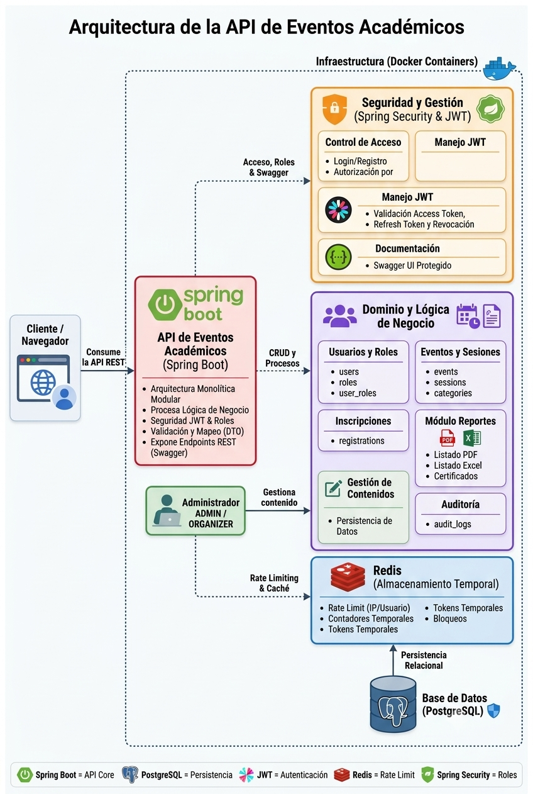

---

## Modelo Entidad-Relación

**Descripción:** Diagrama entidad-relación generado a partir del script de base de datos.

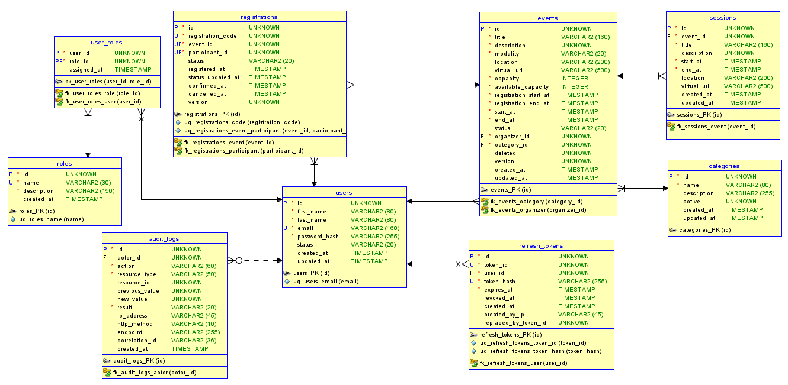

---

# Capturas de Pantalla y Evidencias de Prueba

## 1. Servidor funcionando
**Descripción:** Se verifica que la API Spring Boot esté levantada correctamente y pueda recibir solicitudes HTTP.

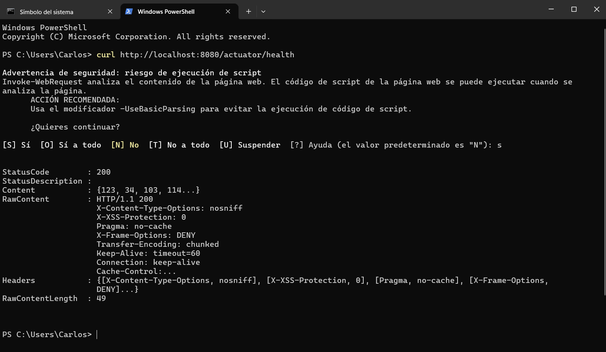

---

## 2. Backend levantado
**Descripción:** Se comprueba el estado de salud del backend mediante el endpoint de Actuator. Una respuesta con estado `UP` confirma que la aplicación inició correctamente.

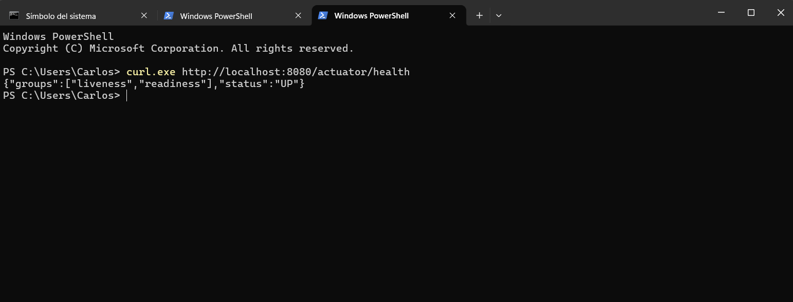

---

## 3. Comprobar Swagger
**Descripción:** Se verifica el acceso a la documentación de la API mediante Swagger UI, protegida mediante Spring Security y credenciales de autenticación JWT.

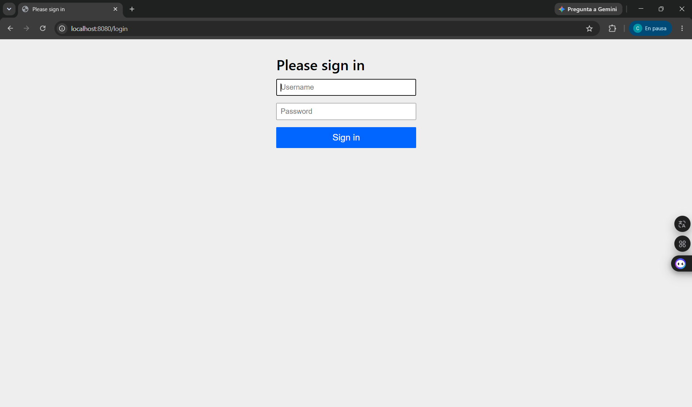

---

## 4. Verificación de base de datos PostgreSQL
Se accede al contenedor PostgreSQL mediante Docker para comprobar la existencia de la base de datos y consultar las tablas creadas por los scripts iniciales.

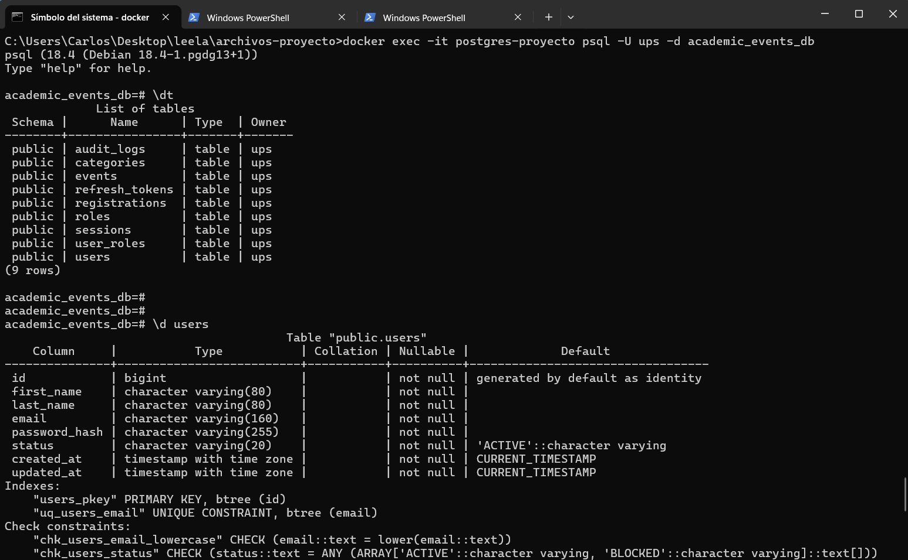

Comando utilizado:

```bash
docker exec -it postgres-proyecto psql -U ups -d academic_events_db
```

Comandos utilizados dentro de PostgreSQL:
```
-- Mostrar las tablas existentes
\dt

-- Revisar estructura de usuarios
\d users

-- Revisar estructura de roles
\d roles

-- Revisar tabla intermedia usuario-rol
\d user_roles
```

---

## 5. Verificación de Swagger UI
**Descripción:** Se levanta el servicio Spring Boot y se accede a la interfaz de Swagger UI para comprobar que la documentación `OpenAPI` se genera correctamente y que los endpoints de los distintos controladores (Events, Categories, etc.) están correctamente expuestos.

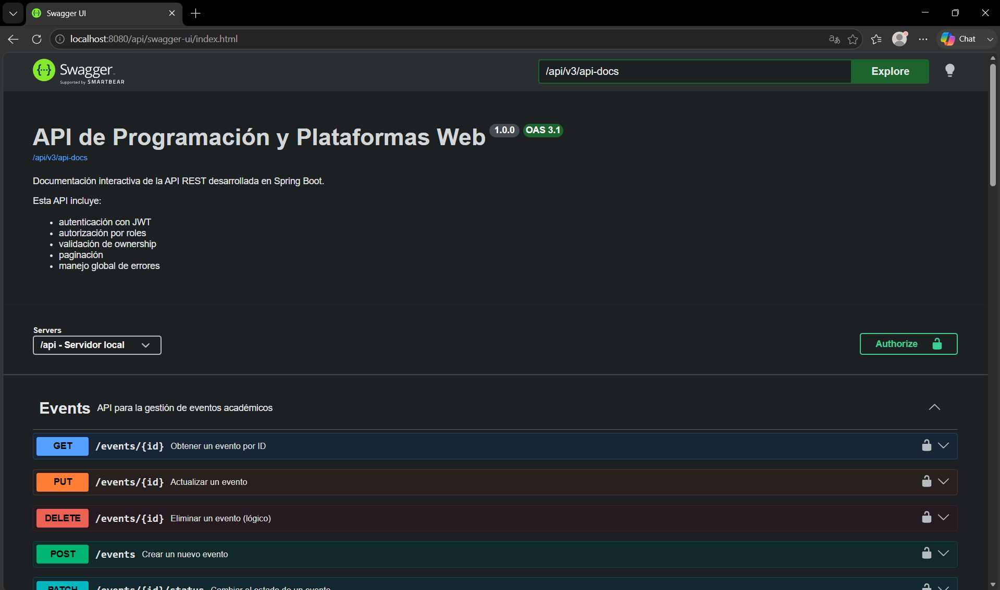

---

## 6. Autenticación y generación de token JWT
**Descripción:** Se envía una petición `POST` al endpoint `/api/auth/login` con el correo y la contraseña de un usuario administrador registrado en la base de datos. Si las credenciales son correctas, el sistema genera un `accessToken` y un `refreshToken` usando JWT. Estos tokens se utilizan para acceder a los endpoints protegidos de la aplicación.

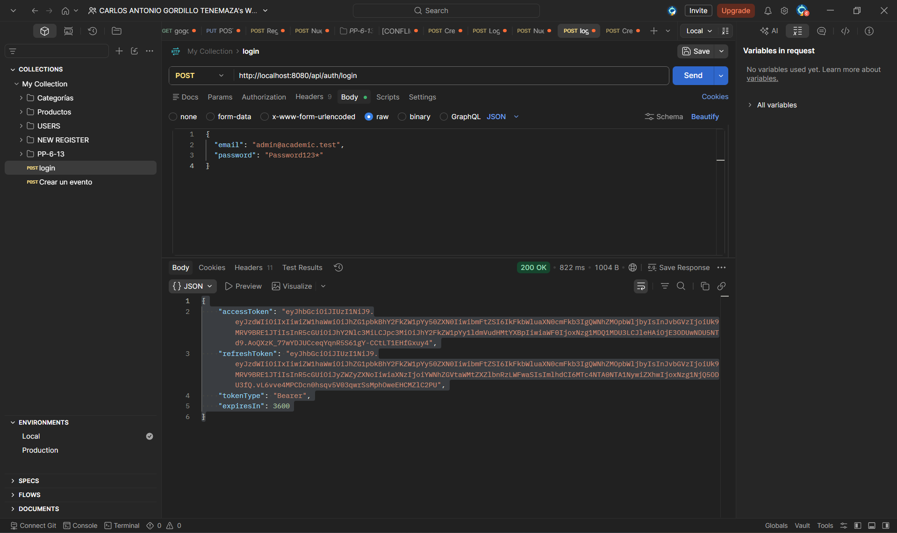

---

## 7. Creación de un evento autenticado
**Descripción:** Se envía una petición `POST` al endpoint `/api/events` usando el `accessToken` como **Bearer Token**. Si el usuario tiene el rol adecuado (`ADMIN` u `ORGANIZER`), el sistema crea el nuevo evento y devuelve una respuesta con el estado `201 Created`.

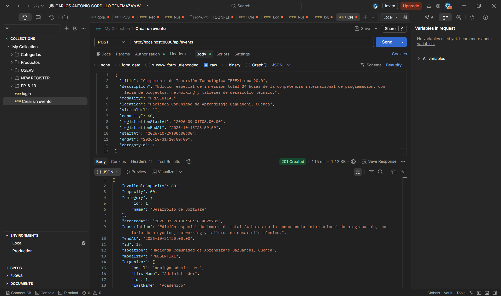

---

## 8. Pruebas unitarias del módulo de Eventos
**Descripción:** Se implementaron pruebas unitarias con JUnit 5 y Mockito para `EventServiceImpl`, cubriendo los casos de creación, actualización, eliminación lógica y consulta de eventos. Se validan tanto los flujos exitosos como las reglas de negocio (título duplicado, modalidad inválida, fechas inconsistentes, ownership de organizador vs administrador, y estados que impiden eliminación).

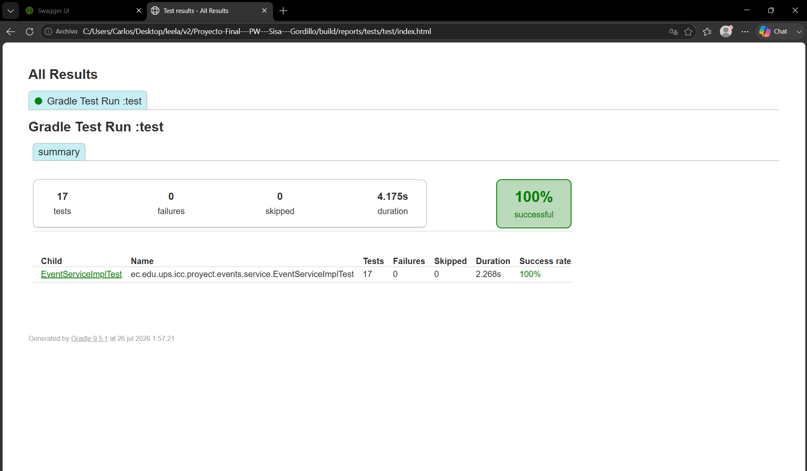

---

## 9. Actualización de Pruebas Unitarias del Módulo de Eventos
**Descripción:** Se implementaron pruebas unitarias completas con JUnit 5 y Mockito para `EventServiceImpl`, cubriendo los casos de creación, actualización, cambio de estado (`updateStatus`), eliminación lógica y consulta de eventos. Se validan tanto los flujos exitosos como las reglas de negocio (título duplicado, modalidad inválida, fechas inconsistentes, transiciones de estado permitidas, y ownership de organizador frente a administrador).

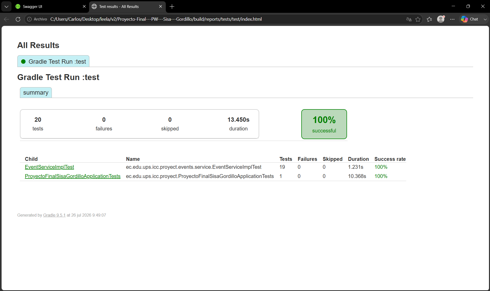

**Resultado:** 20 pruebas unitarias ejecutadas de manera exitosa (100% de éxito).

---

## 10. Rate Limiting con Redis Cloud

**Descripción:** Se implementó un límite de **5 intentos de inicio de sesión por minuto** usando Redis Cloud para guardar temporalmente el contador de solicitudes por IP. Si se supera el límite, la API responde con **`429 Too Many Requests`**.

Se enviaron **6 solicitudes de login** en menos de un minuto. Las primeras **5** respondieron correctamente y la **6.ª** fue bloqueada con el código **`429 Too Many Requests`**.

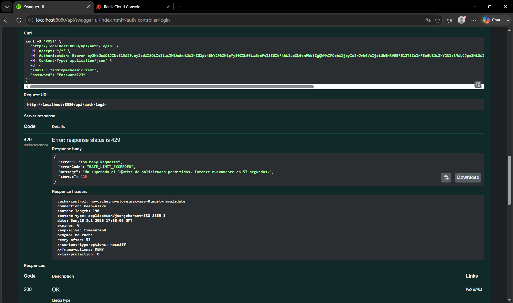

---

## 11. Verificación en Redis

**Descripción:** Se comprobó en `RedisInsight` que la clave `rate-limit:login:<ip>` se crea correctamente y se elimina automáticamente al finalizar el tiempo configurado.

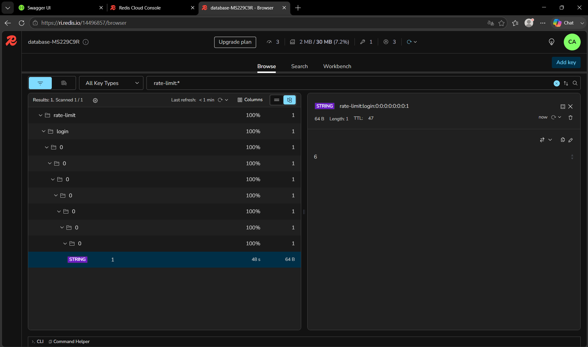

---

## 12. Módulo de Inscripciones (`/api/registrations`)

**Descripción:** Las siguientes pruebas validan el ciclo de vida completo de las inscripciones a eventos académicos, verificando las reglas de autorización para los roles `PARTICIPANT` y `ORGANIZER`, así como el manejo de las principales reglas de negocio y excepciones de la API.

Para ejecutar las pruebas en Postman es necesario autenticarse previamente mediante el endpoint de login (`POST /api/auth/login`). A continuación se muestran las credenciales disponibles según el rol del usuario.

### ADMIN

**Rol:** `ADMIN`

```json
{
  "email": "admin@academic.test",
  "password": "Password123*"
}
```

---

### ORGANIZER + PARTICIPANT (María Fernanda Cordero)

**Roles:** `ORGANIZER`, `PARTICIPANT`

```json
{
  "email": "maria.cordero@academic.test",
  "password": "Password123*"
}
```

---

### ORGANIZER + PARTICIPANT (José Andrés Mora)

**Roles:** `ORGANIZER`, `PARTICIPANT`

```json
{
  "email": "jose.mora@academic.test",
  "password": "Password123*"
}
```

---

### ORGANIZER + PARTICIPANT (Ana Lucía Torres)

**Roles:** `ORGANIZER`, `PARTICIPANT`

```json
{
  "email": "ana.torres@academic.test",
  "password": "Password123*"
}
```

---

### PARTICIPANT (Nicolás Ortega)

**Rol:** `PARTICIPANT`

```json
{
  "email": "nicolas.ortega@academic.test",
  "password": "Password123*"
}
```

---

### Usuario bloqueado

**Rol:** `PARTICIPANT`

> Este usuario se encuentra con estado `BLOCKED`, por lo que no podrá autenticarse correctamente.

```json
{
  "email": "andres.sarmiento@academic.test",
  "password": "Password123*"
}
```

### Uso recomendado de cada usuario

| Funcionalidad | Usuario recomendado |
|---------------|---------------------|
| Administración de usuarios, roles y categorías | ADMIN |
| Listar inscritos de un evento | ORGANIZER |
| Confirmar o rechazar inscripciones | ORGANIZER |
| Crear, editar o eliminar eventos | ORGANIZER |
| Consultar eventos públicos | PARTICIPANT |
| Crear una inscripción | PARTICIPANT |
| Consultar mis inscripciones | PARTICIPANT |
| Cancelar una inscripción propia | PARTICIPANT |

---

## 12.1. Consulta de Inscripciones Propias (`GET /api/registrations/mine`)

**Descripción:** Se verificó el listado paginado de las inscripciones pertenecientes al usuario autenticado con rol `PARTICIPANT`, comprobando que únicamente se devuelvan sus registros.

* **Método:** `GET`
* **Endpoint:** `/api/registrations/mine`
* **Estado HTTP:** `200 OK`

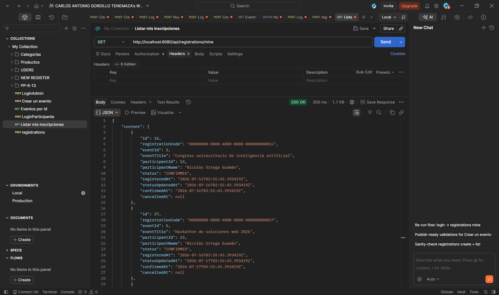

```json
{
  "content": [
    {
      "id": 16,
      "registrationCode": "00000000-0000-4000-8000-000000000016",
      "eventId": 2,
      "eventTitle": "Congreso universitario de inteligencia artificial",
      "participantId": 13,
      "participantName": "Nicolás Ortega Guamán",
      "status": "CONFIRMED",
      "registeredAt": "2026-07-15T03:55:43.393419Z",
      "statusUpdatedAt": "2026-07-16T03:55:43.393419Z",
      "confirmedAt": "2026-07-16T03:55:43.393419Z",
      "cancelledAt": null
    }
  ],
  "totalElements": 3,
  "totalPages": 1
}
```

---

### 12.2. Registro Exitoso en un Evento Publicado (`POST /api/registrations`)

**Descripción:** Se realizó una inscripción exitosa en un evento con estado `PUBLISHED` y cupos disponibles. La respuesta confirma la generación automática del identificador `UUID`, el estado inicial `PENDING` y el registro de la fecha de inscripción.

* **Método:** `POST`
* **Endpoint:** `/api/registrations`
* **Estado HTTP:** `201 Created`

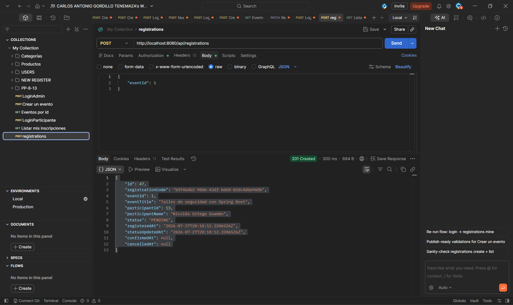

```json
{
  "id": 47,
  "status": "PENDING",
  "registeredAt": "2026-07-27T20:18:12.3206526Z",
  "statusUpdatedAt": "2026-07-27T20:18:12.3206526Z"
}
```

---

### 12.3. Validación de Reglas de Negocio

#### A. Intento de Inscripción Duplicada (`409 Conflict`)

**Descripción:** Se comprobó la restricción de unicidad (`uq_registrations_event_participant`), impidiendo que un participante pueda registrarse más de una vez en el mismo evento.

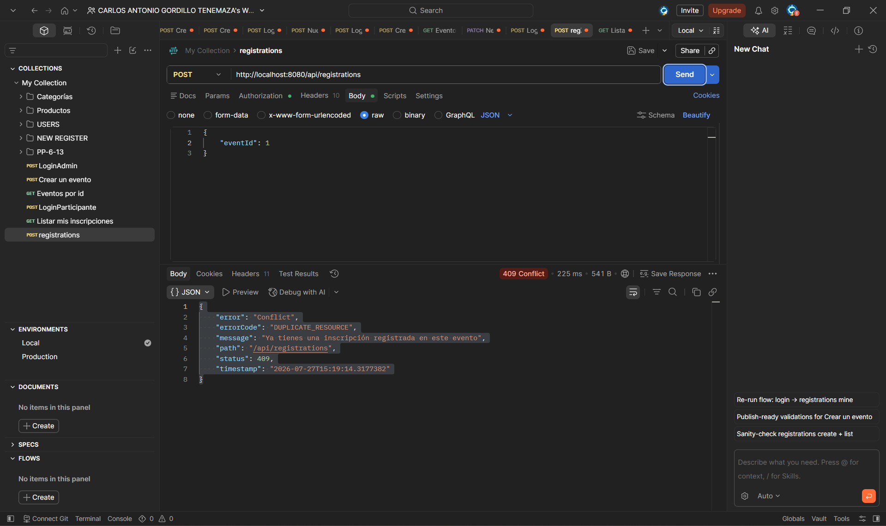

```json
{
  "error": "Conflict",
  "errorCode": "DUPLICATE_RESOURCE",
  "message": "Ya tienes una inscripción registrada en este evento",
  "status": 409
}
```

#### B. Intento de Inscripción en un Evento no Publicado (`400 Bad Request`)

**Descripción:** Se verificó que únicamente los eventos con estado `PUBLISHED` permiten nuevas inscripciones. Cualquier otro estado es rechazado por la API.

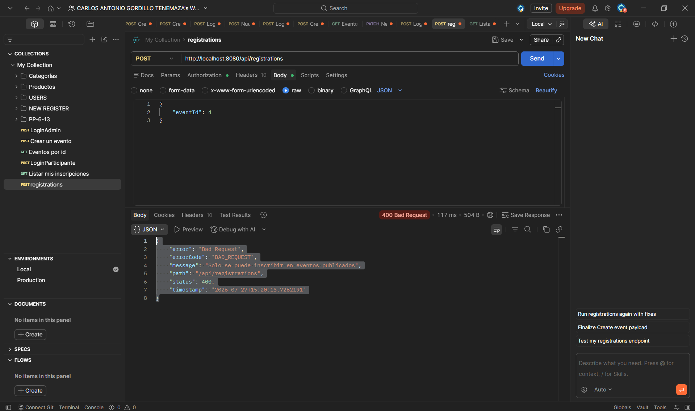

```json
{
  "error": "Bad Request",
  "errorCode": "BAD_REQUEST",
  "message": "Solo se puede inscribir en eventos publicados",
  "status": 400
}
```

---

### 12.4. Consulta Individual y Cancelación de una Inscripción

#### A. Consulta por Identificador (`GET /api/registrations/{id}`)

**Descripción:** Se verificó la recuperación del detalle de una inscripción específica, comprobando que únicamente el propietario pueda acceder a la información.

* **Método:** `GET`
* **Endpoint:** `/api/registrations/{id}`
* **Estado HTTP:** `200 OK`

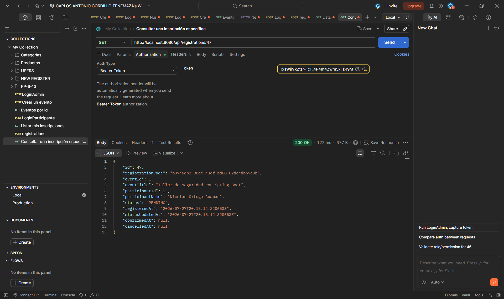

```json
{
  "id": 47,
  "status": "PENDING"
}
```

#### B. Cancelación por el Participante (`PATCH /api/registrations/{id}/status`)

**Descripción:** El participante canceló su inscripción previamente registrada. La respuesta confirma la actualización del estado a `CANCELLED` y el registro de la fecha de cancelación.

* **Método:** `PATCH`
* **Endpoint:** `/api/registrations/{id}/status`
* **Estado HTTP:** `200 OK`

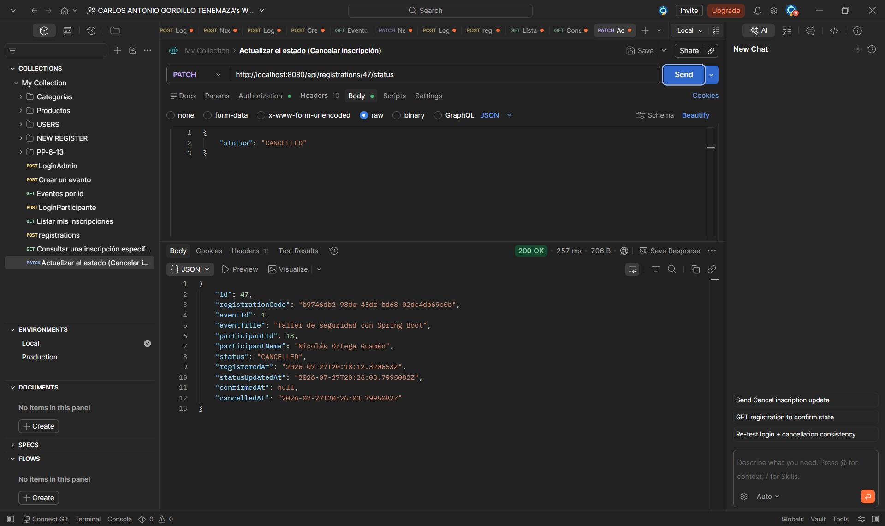

```json
{
  "id": 47,
  "status": "CANCELLED",
  "cancelledAt": "2026-07-27T20:26:03.7995082Z"
}
```

---

### 12.5. Gestión de Inscripciones por el Organizador

#### A. Listado de Inscritos por Evento (`GET /api/registrations/event/{eventId}`)

**Descripción:** La organizadora del evento consulta el listado de participantes registrados para administrar las solicitudes de inscripción.

* **Método:** `GET`
* **Endpoint:** `/api/registrations/event/{eventId}`
* **Estado HTTP:** `200 OK`

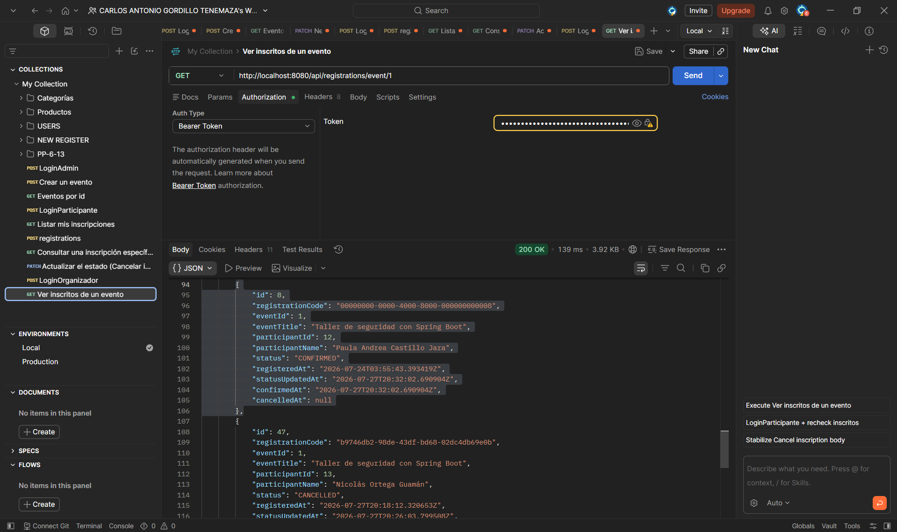

#### B. Confirmación de una Inscripción (`PATCH /api/registrations/{id}/status`)

**Descripción:** La organizadora confirmó una inscripción en estado `PENDING`, actualizando su estado a `CONFIRMED` y reflejando el cambio en la capacidad disponible del evento.

* **Método:** `PATCH`
* **Endpoint:** `/api/registrations/{id}/status`
* **Estado HTTP:** `200 OK`

```json
{
  "status": "CONFIRMED"
}
```

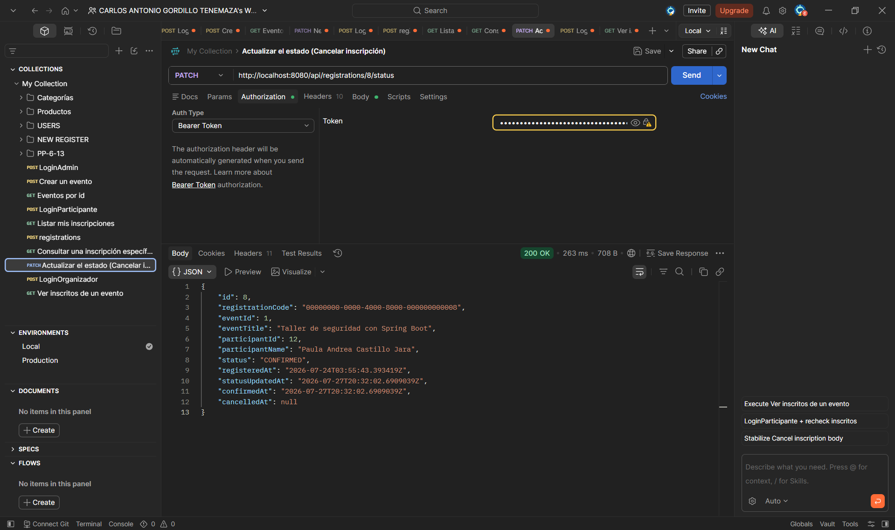

```json
{
  "id": 8,
  "registrationCode": "00000000-0000-4000-8000-000000000008",
  "eventId": 1,
  "eventTitle": "Taller de seguridad con Spring Boot",
  "participantId": 12,
  "participantName": "Paula Andrea Castillo Jara",
  "status": "CONFIRMED"
}
```

#### C. Intento de Transición Inválida de `CONFIRMED` a `PENDING` (`400 Bad Request`)

**Descripción:** Se verificó que la API impide regresar manualmente una inscripción al estado `PENDING`, preservando la integridad del flujo de estados.

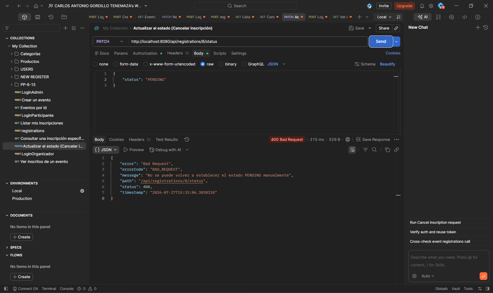

```json
{
  "error": "Bad Request",
  "errorCode": "BAD_REQUEST",
  "message": "No se puede volver a establecer el estado PENDING manualmente",
  "status": 400
}
```

---

## 13. Iniciar Sesión

**Descripción:** Se envía el siguiente JSON al endpoint de login y se obtiene el `accessToken` junto con el `refreshToken`.

* **Método:** `POST`
* **Endpoint:** `/api/auth/login`

```json
{
  "email": "admin@academic.test",
  "password": "Password123*"
}
```

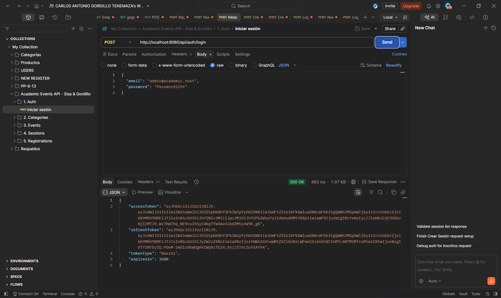

---

## 14. Crear Categoría

**Descripción:** Se crea una categoría utilizando el `accessToken` del usuario ADMIN. Resultado: categoría con `id: 8`.

* **Método:** `POST`
* **Endpoint:** `/api/categories`

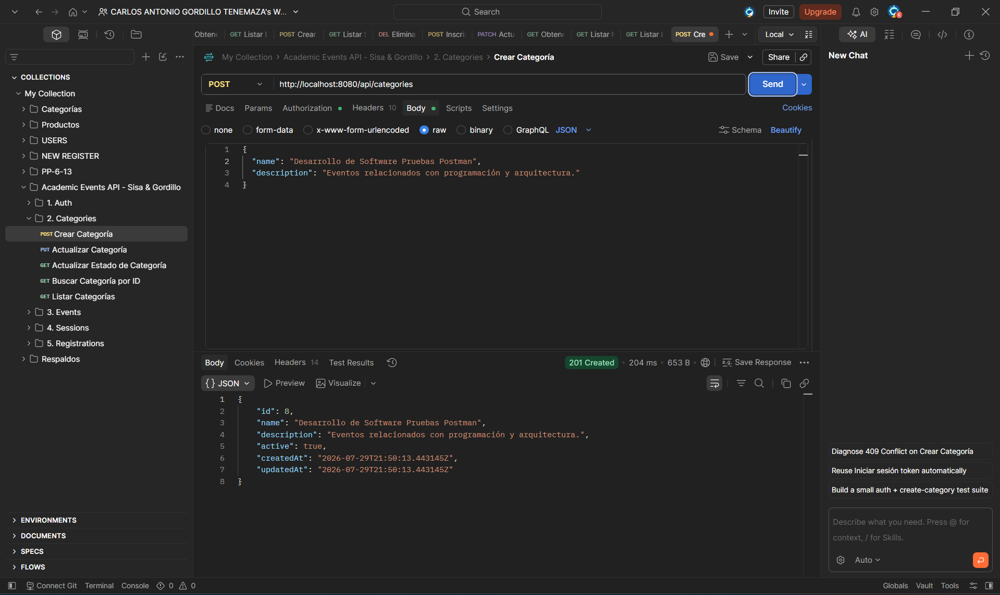

---

## 15. Actualizar Categoría

**Descripción:** Se actualiza el nombre y descripción de la categoría creada.

* **Método:** `PUT` (o `PATCH`, confirmar según el controller)
* **Endpoint:** `/api/categories/{id}`

```json
{
  "name": "Ingeniería de Software Avanzada",
  "description": "Actualización de la descripción de la categoría"
}
```

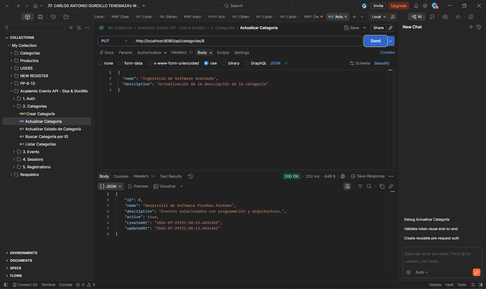

---

## 16. Actualizar Estado de Categoría

**Descripción:** Se cambia el estado `active` de una categoría existente.

* **Método:** `PATCH`
* **Endpoint:** `/api/categories/{id}/status`

```json
{
  "active": false
}
```

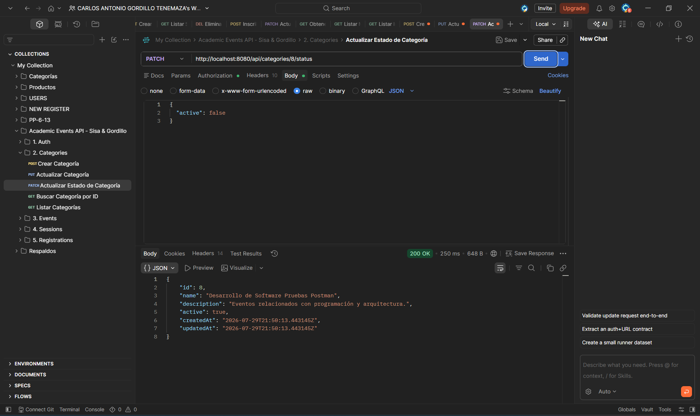

---

## 17. Buscar Categoría por ID

**Descripción:** Se consulta el detalle de una categoría específica por su identificador.

* **Método:** `GET`
* **Endpoint:** `/api/categories/{id}`

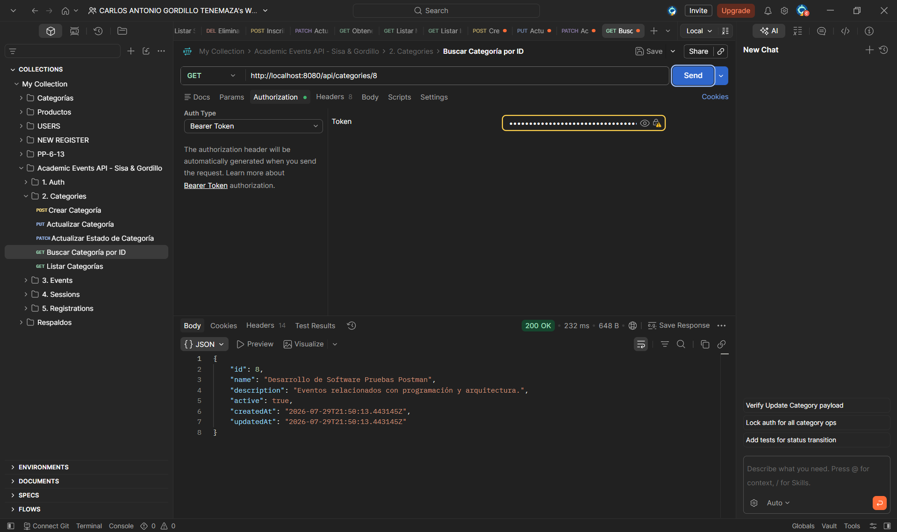

---

## 18. Listar Categorías

**Descripción:** Se obtiene el listado completo de categorías registradas.

* **Método:** `GET`
* **Endpoint:** `/api/categories`

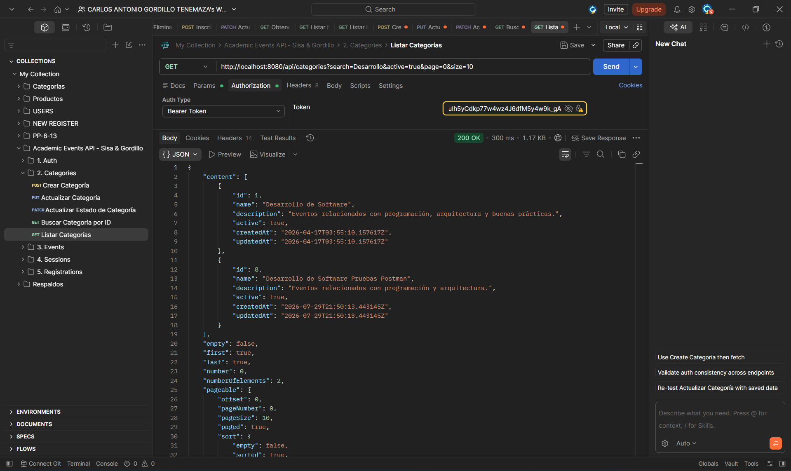

---

## 19. Crear Evento

**Descripción:** Se crea un nuevo evento académico en estado `DRAFT`.

* **Método:** `POST`
* **Endpoint:** `/api/events`

```json
{
  "title": "Postman - Taller de seguridad con Angular",
  "description": "Construcción de una API REST segura.",
  "modality": "PRESENTIAL",
  "location": "Laboratorio de Computación 9",
  "virtualUrl": null,
  "capacity": 60,
  "registrationStartAt": "2026-08-01T08:00:00",
  "registrationEndAt": "2026-08-15T23:59:00",
  "startAt": "2026-08-20T08:00:00",
  "endAt": "2026-08-20T12:00:00",
  "categoryId": 1
}
```

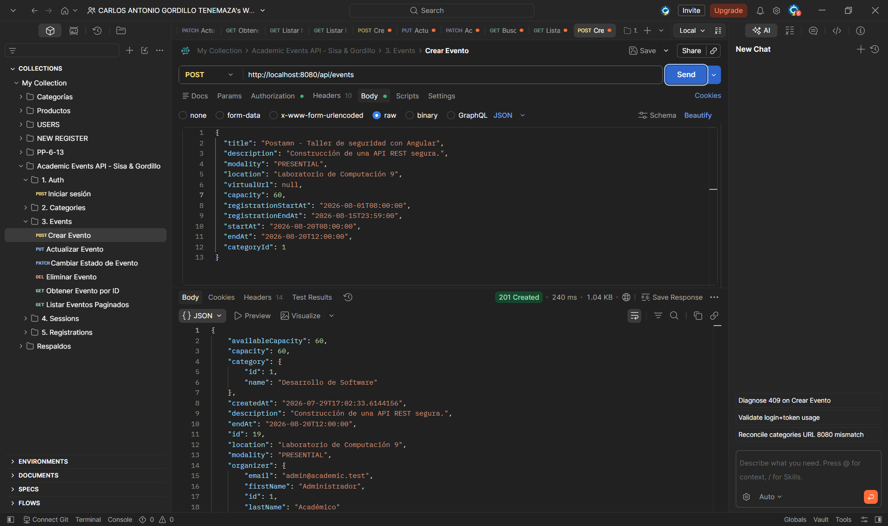

---

## 20. Actualizar Evento

**Descripción:** Se actualizan los datos generales del evento (sin modificar su estado).

* **Método:** `PUT`
* **Endpoint:** `/api/events/{id}`

```json
{
  "title": "Actualización | Taller Avanzado de seguridad con Angular",
  "description": "Actualización del contenido del taller.",
  "modality": "PRESENTIAL",
  "location": "Laboratorio de Computación 5",
  "virtualUrl": null,
  "capacity": 30,
  "registrationStartAt": "2026-08-01T08:00:00",
  "registrationEndAt": "2026-08-15T23:59:00",
  "startAt": "2026-08-20T08:00:00",
  "endAt": "2026-08-20T13:00:00",
  "categoryId": 1
}
```

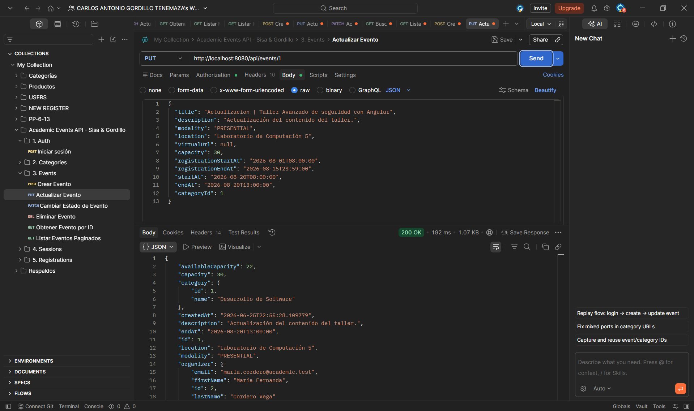

---

## 21. Cambiar Estado de un Evento

**Descripción:** Se cambia el estado del evento con `id: 19` de `DRAFT` a `PUBLISHED`.

* **Método:** `PATCH`
* **Endpoint:** `/api/events/{id}/status`

```json
{
  "status": "PUBLISHED"
}
```

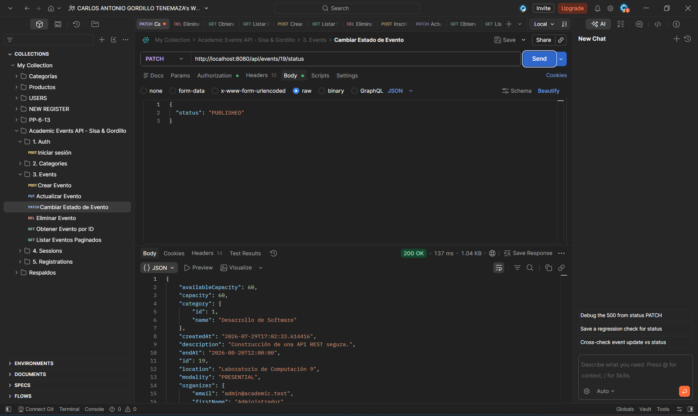

---

## 22. Eliminar Evento

**Descripción:** Se intenta borrar un evento en estado `PUBLISHED`, lo que la API rechaza correctamente con `409 Conflict` (`errorCode: CONFLICT`), respetando la regla de negocio que impide eliminar eventos ya publicados.

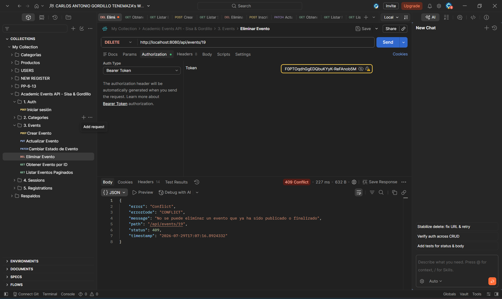

Para completar la prueba, se crea un nuevo evento con `id: 20` en estado `DRAFT` y se realiza la eliminación exitosamente.

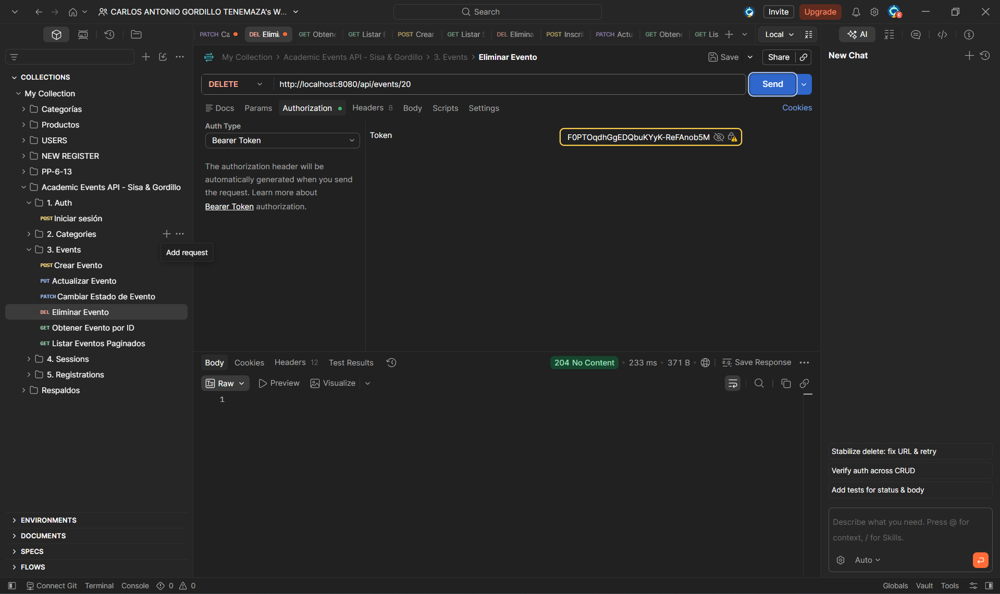

---

## 23. Obtener Evento por ID

**Descripción:** Se consulta el detalle del evento con `id: 7`.

* **Método:** `GET`
* **Endpoint:** `/api/events/{id}`

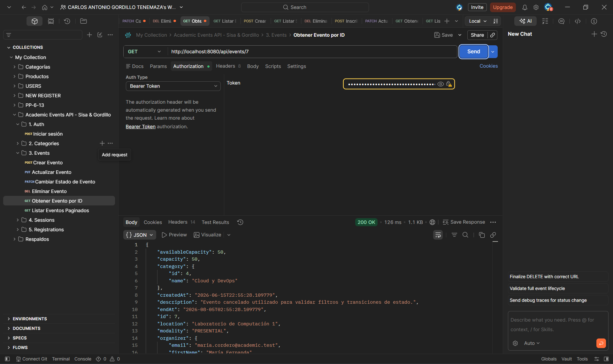

---

## 24. Listar Eventos con Paginación y Filtros

**Descripción:** Se listan los eventos aplicando filtros de título y estado.

* **Método:** `GET`
* **Endpoint:** `/api/events/page?title=Spring&status=PUBLISHED&page=0&size=10`

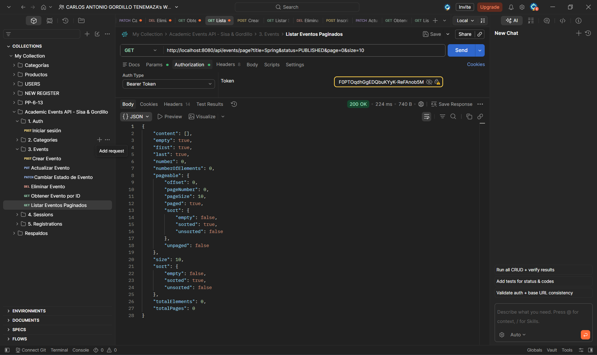

---

## 25. Crear Sesión

**Descripción:** Se crea una sesión asociada al evento con `eventId: 1`.

* **Método:** `POST`
* **Endpoint:** `/api/sessions`

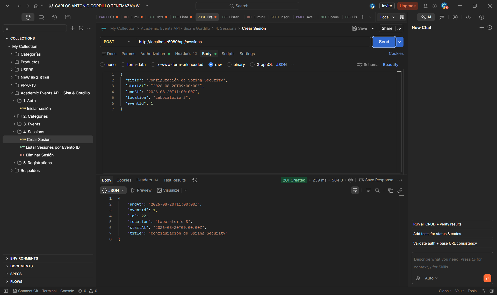

---

## 26. Listar Sesiones por Evento

**Descripción:** Se listan las sesiones del evento con `eventId: 1`.

* **Método:** `GET`
* **Endpoint:** `/api/sessions/event/{eventId}`

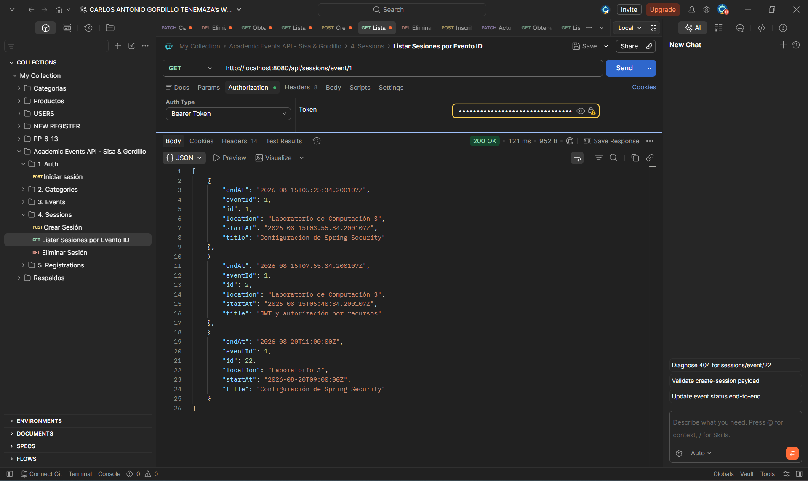

---

## 27. Eliminar Sesión

**Descripción:** Se elimina la sesión creada previamente.

* **Método:** `DELETE`
* **Endpoint:** `/api/sessions/{id}`

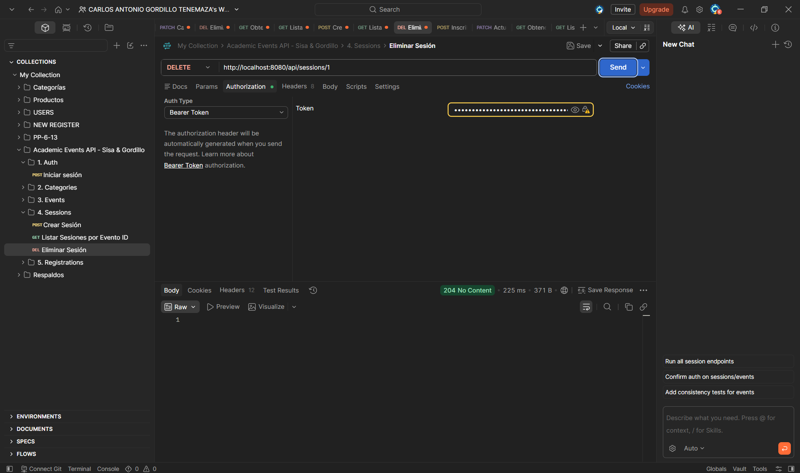

---

## 28. Inscribirse a un Evento (rol PARTICIPANT)

**Descripción:** Autenticado como participante, se realiza la inscripción a un evento publicado.

* **Método:** `POST`
* **Endpoint:** `/api/registrations`

Usuario utilizado para la prueba:
```json
{
  "email": "nicolas.ortega@academic.test",
  "password": "Password123*"
}
```

> ⚠️ **Pendiente:** confirmar la captura correcta de este endpoint; actualmente referencia la misma imagen que el listado de categorías (`106-listar-categorias-id.png`), lo cual parece un error al pegar el enlace. Reemplazar por la captura real de la inscripción.

Resultado esperado:
```json
{
  "participantName": "Nicolás Ortega Guamán",
  "status": "PENDING"
}
```

---

## 29. Actualizar Estado de una Inscripción — Control de Roles

**Descripción:** Un participante intenta actualizar el estado de su propia inscripción y la API responde `403 Forbidden`, ya que solo el rol `ADMIN` (o el organizador del evento) puede realizar esta acción.

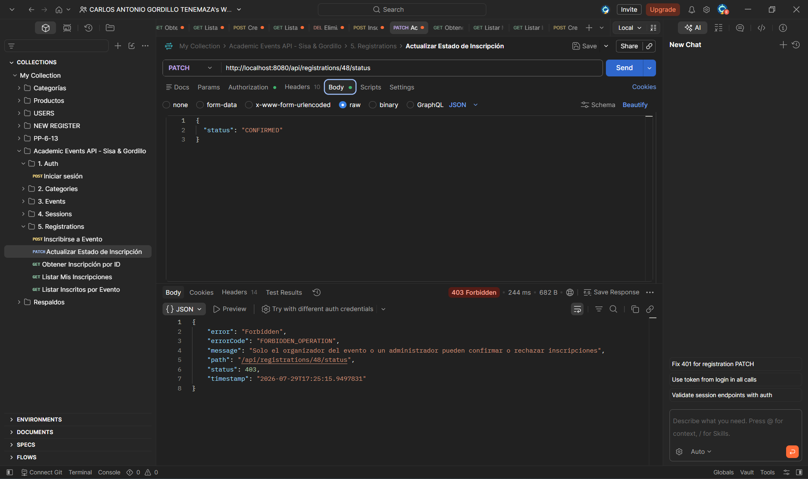

El único que puede hacerlo es el administrador:

```json
{
  "email": "admin@academic.test",
  "password": "Password123*"
}
```

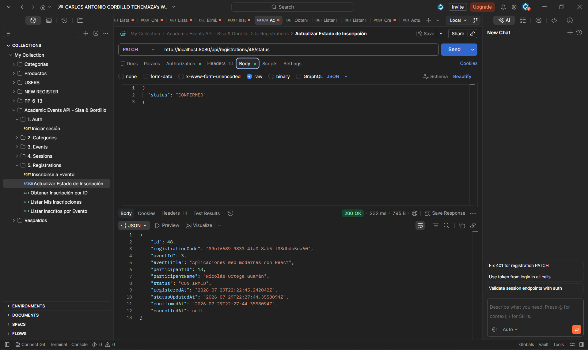

Resultado:
```json
{
  "participantName": "Nicolás Ortega Guamán",
  "status": "CONFIRMED"
}
```

---

## 30. Obtener Inscripción por ID

**Descripción:** Se consulta el detalle de una inscripción específica por su identificador.

* **Método:** `GET`
* **Endpoint:** `/api/registrations/{id}`

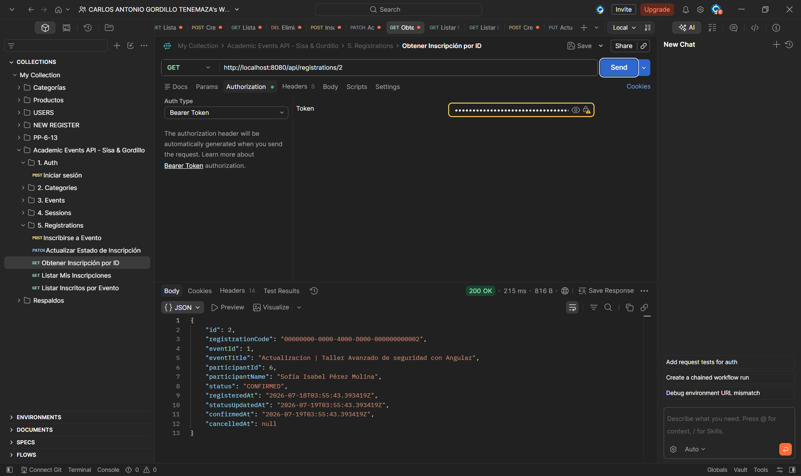

---

## 31. Listar Mis Inscripciones

**Descripción:** Solo los usuarios con rol `PARTICIPANT` pueden consultar el listado de sus propias inscripciones.

* **Método:** `GET`
* **Endpoint:** `/api/registrations/mine`

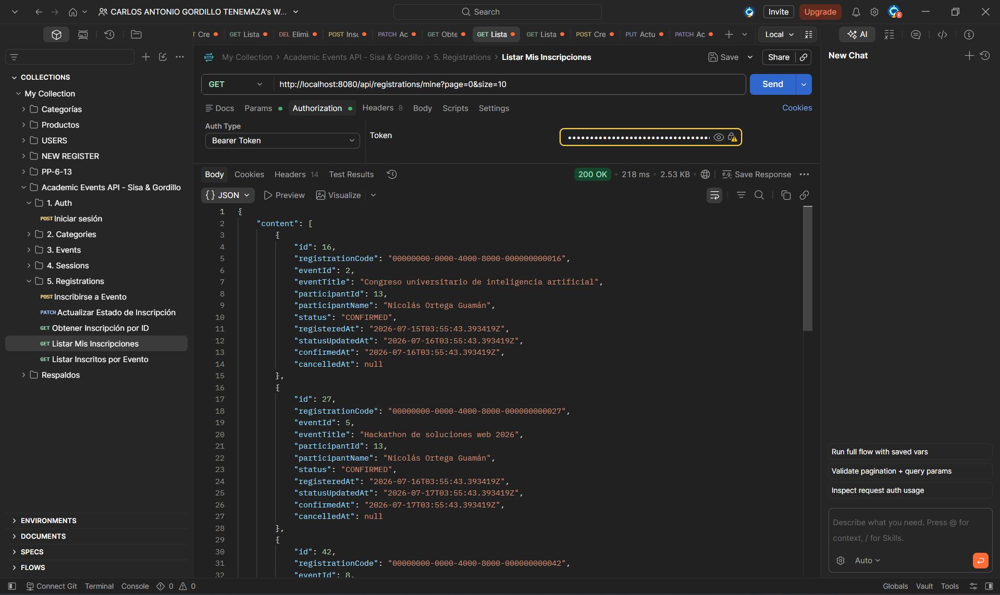

---

## 32. Listar Inscritos por Evento

**Descripción:** Se listan los inscritos del evento con `id: 5`.

* **Método:** `GET`
* **Endpoint:** `/api/registrations/event/{eventId}`

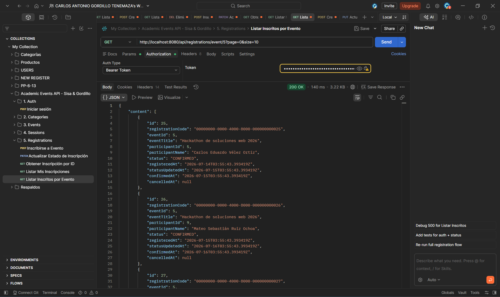

---

## 33. Generación de Reporte de Inscritos en PDF

**Descripción:** Se generó y exportó exitosamente el reporte detallado en formato PDF con el listado de participantes inscritos para un evento específico, validando previamente los permisos de propiedad u rol administrativo.

* **Método:** `GET`
* **Endpoint:** `/api/reports/events/{eventId}/registrations.pdf`

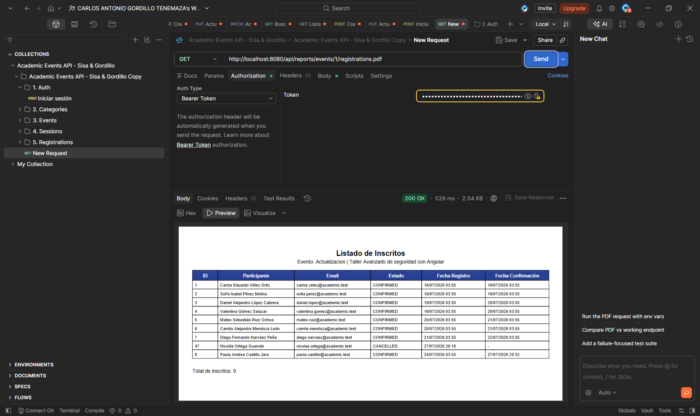
---

## 34. Seguridad: Configuración CORS Restringida
**Descripción:** Se implementó una configuración estricta de Cross-Origin Resource Sharing (CORS) a nivel global mediante la clase `CorsConfig`, garantizando que solo clientes autorizados puedan interactuar con la API.

**Reglas de seguridad aplicadas:**
* **Orígenes Permitidos:** Se leen dinámicamente desde las variables de entorno (`cors.allowed-origins`), bloqueando cualquier petición desde dominios no listados.
* **Métodos HTTP Permitidos:** Restringido exclusivamente a `GET`, `POST`, `PUT`, `PATCH`, `DELETE` y `OPTIONS`.
* **Cabeceras Permitidas:** Limitado a `Authorization` (para los tokens JWT) y `Content-Type`.
* **Credenciales:** Deshabilitadas (`allowCredentials = false`) como medida adicional de seguridad al utilizar autenticación basada en tokens sin estado (JWT).


---

## 35. Evidencia de Pruebas Unitarias Exitosas

**Descripción:** Se ejecutaron todas las pruebas unitarias del proyecto mediante el wrapper de Gradle, obteniendo un 100% de éxito en los módulos del sistema.

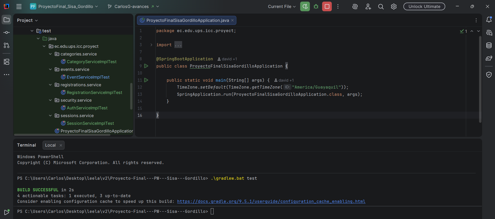
---

## Despliegue


- **URL pública del backend:**
- https://proyecto-final-pw-sisa-gordillo.onrender.com
  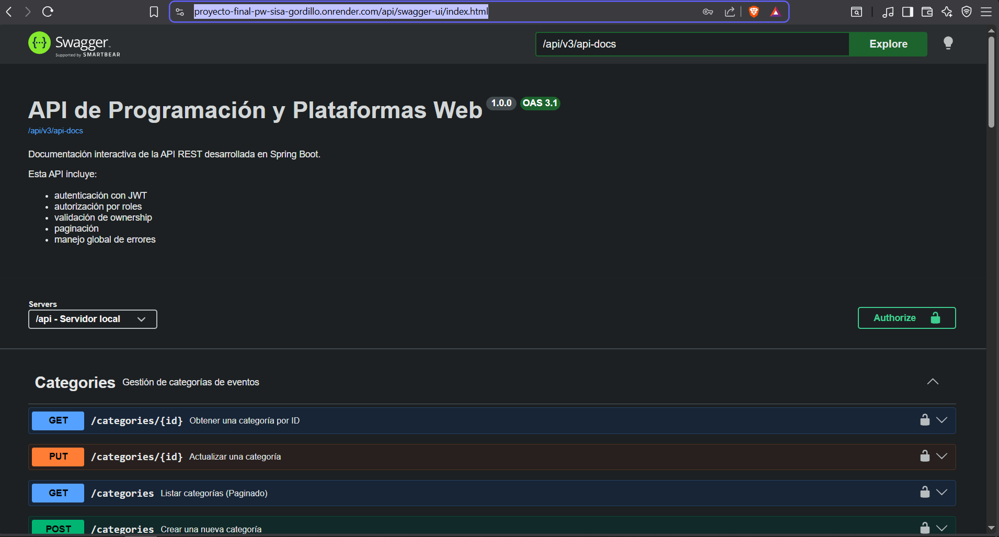

- **Plataforma utilizada:** Render Completo !

  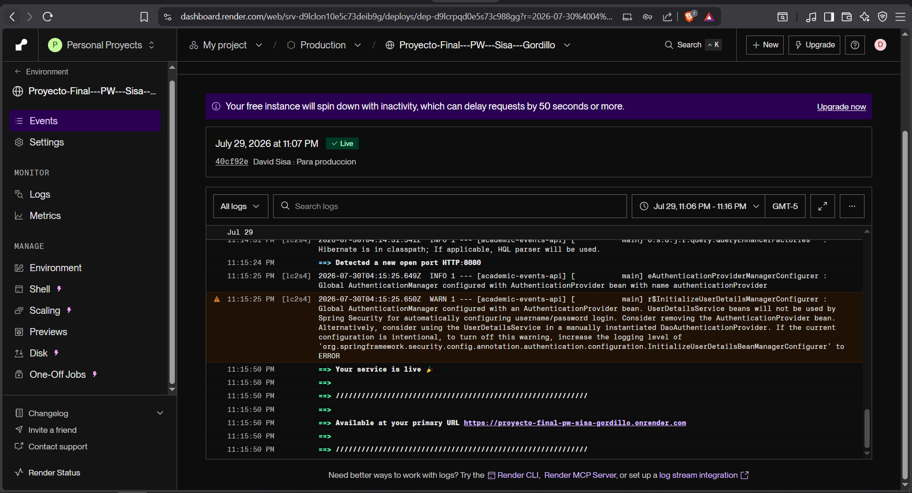
