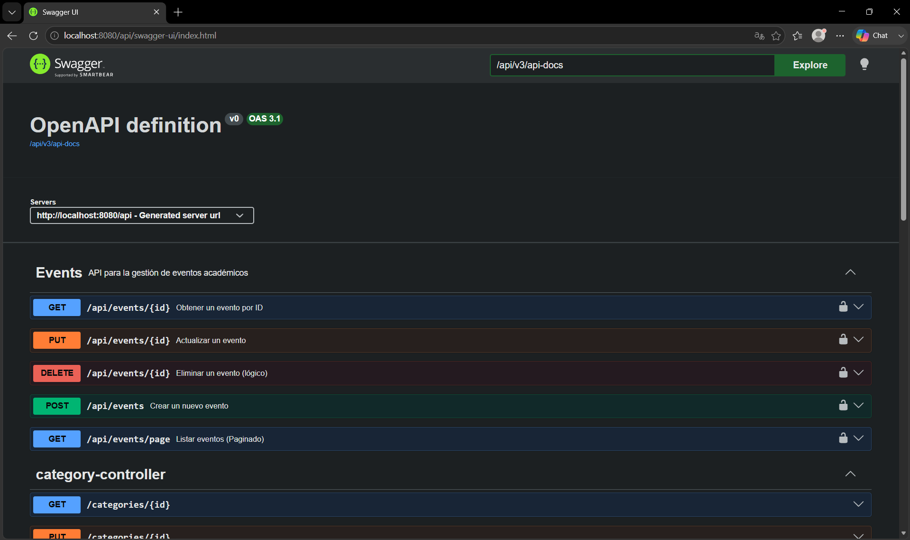

# Programación y Plataformas Web


# Academic Events API
## Sistema de Gestión de Eventos Académicos con Spring Boot, JWT y PostgreSQL

<div align="center">
  
  
  
  
</div>

---

## Proyecto Final

## Autores

**Carlos Antonio Gordillo Tenemaza**
* 📧 Correo: [antoniogordillo.1808@gmail.com](mailto:antoniogordillo.1808@gmail.com)
* 💻 GitHub: [antonikr8s](https://github.com/antonikr8s)
* 💼 LinkedIn: [Carlos Gordillo](https://linkedin.com/in/carlos-antonio-gordillo-tenemaza-828540281/)

**David Esteban Sisa Buestan**
* 📧 Correo: [sisabuestandavidesteban@gmail.com](mailto:sisabuestandavidesteban@gmail.com)
* 💻 GitHub: [Riiiiii1](https://github.com/Riiiiii1)
* 💼 LinkedIn: [David Sisa](https://www.linkedin.com/in/david-esteban-sisa-buestan/)


---

## Capturas de Pantalla


### 1. Servidor funcionando
**Descripción:** Se verifica que la API Spring Boot esté levantada correctamente y pueda recibir solicitudes HTTP.


### 2. Backend levantado
**Descripción:** Se comprueba el estado de salud del backend mediante el endpoint de Actuator. Una respuesta con estado `UP` confirma que la aplicación inició correctamente.


### 3. Comprobar Swagger
**Descripción:** Se verifica el acceso a la documentación de la API mediante Swagger UI. Actualmente la ruta está protegida por Spring Security mientras se termina la configuración de autenticación JWT.


### 4. Verificación de base de datos PostgreSQL
Se accede al contenedor PostgreSQL mediante Docker para comprobar la existencia de la base de datos y consultar las tablas creadas por los scripts iniciales.


Comando utilizado:

```bash
docker exec -it postgres-proyecto psql -U ups -d academic_events_db
```
Comandos utilizados dentro de PostgreSQL:
```
-- Mostrar las tablas existentes
\dt

-- Revisar estructura de usuarios
\d users

-- Revisar estructura de roles
\d roles

-- Revisar tabla intermedia usuario-rol
\d user_roles
```
### 5. Verificación de Swagger UI
**Descripción:** Se levanta el servicio Spring Boot y se accede a la interfaz de Swagger UI para comprobar que la documentación `OpenAPI` se genera correctamente y que los endpoints de los distintos controladores (Events, Categories, etc.) están correctamente expuestos.



### 6. Autenticación y generación de token JWT
**Descripción:** Se realiza una petición `POST` al endpoint `/api/auth/login` enviando las credenciales de un usuario administrador registrado en la base de datos. El servicio valida el correo y la contraseña contra el hash almacenado (BCrypt), y en caso de éxito genera un `accessToken` y un `refreshToken` firmados con JWT (HS256), los cuales se utilizarán para autenticar las siguientes peticiones a los endpoints protegidos.


### 7. Creación de un evento autenticado
**Descripción:** Utilizando el `accessToken` obtenido en el paso anterior como *Bearer Token*, se realiza una petición `POST` al endpoint `/api/events` con los datos de un nuevo evento académico. Gracias a la anotación `@PreAuthorize("hasAnyRole('ADMIN', 'ORGANIZER')")`, solo un usuario autenticado con el rol correspondiente puede crear el recurso. La API responde con estado `201 Created` y el evento recién registrado.


### 8. Pruebas unitarias del módulo de Eventos
**Descripción:** Se implementaron pruebas unitarias con JUnit 5 y Mockito para `EventServiceImpl`, cubriendo los casos de creación, actualización, eliminación lógica y consulta de eventos. Se validan tanto los flujos exitosos como las reglas de negocio (título duplicado, modalidad inválida, fechas inconsistentes, ownership de organizador vs administrador, y estados que impiden eliminación).


### 9.Actualizacion Pruebas unitarias del módulo de Eventos
Descripción: Se implementaron pruebas unitarias completas con JUnit 5 y Mockito para EventServiceImpl, cubriendo los casos de creación, actualización, cambio de estado (updateStatus), eliminación lógica y consulta de eventos. Se validan tanto los flujos exitosos como las reglas de negocio (título duplicado, modalidad inválida, fechas inconsistentes, transiciones de estado permitidas, y ownership de organizador frente a administrador).


Resultado: 20 pruebas unitarias ejecutadas de manera exitosa (100% de éxito).


